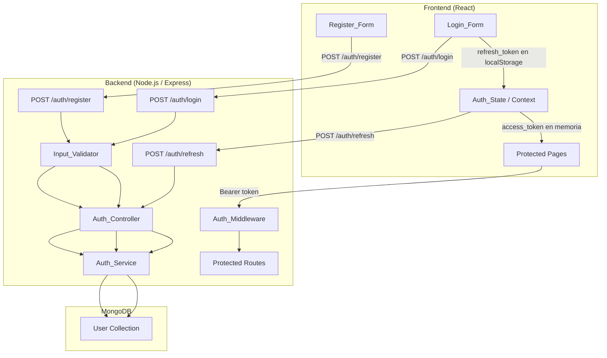

# Design Document

## Overview

Sistema de autenticación JWT para una aplicación web tipo Pinterest. El sistema implementa un flujo de doble token: un **Access Token** de corta duración (15min–1h) almacenado en memoria y un **Refresh Token** de 7 días almacenado en `localStorage`. El backend está construido con Node.js/Express/MongoDB y el frontend con React.

El flujo principal es:
1. El usuario se registra o inicia sesión → recibe ambos tokens.
2. El Access Token se usa en cada petición a rutas protegidas vía header `Authorization: Bearer <token>`.
3. Cuando el Access Token expira, el frontend usa el Refresh Token para obtener uno nuevo sin interrumpir la sesión.

---

## Architecture



**Decisiones de diseño:**
- El Access Token viaja solo en memoria (no en `localStorage` ni cookies) para reducir la superficie de ataque XSS.
- El Refresh Token se guarda en `localStorage` para sobrevivir recargas de página; se acepta el trade-off porque no se usa para acceder a recursos, solo para renovar el Access Token.
- El backend no mantiene estado de sesión (stateless JWT), lo que facilita el escalado horizontal.

---

## Components and Interfaces

### Backend

#### Estructura de carpetas

```
src/
├── routes/
│   └── auth.routes.js        # Define los endpoints /auth/*
├── controllers/
│   └── auth.controller.js    # Lógica de cada endpoint
├── services/
│   └── auth.service.js       # Lógica de negocio (bcrypt, JWT)
├── models/
│   └── user.model.js         # Esquema Mongoose
├── middleware/
│   └── auth.middleware.js    # Validación de Access Token
├── validators/
│   └── auth.validator.js     # Validaciones de input (express-validator)
└── app.js                    # Configuración Express
```

#### Auth Routes (`auth.routes.js`)

```
POST /auth/register  → [validateRegister, authController.register]
POST /auth/login     → [validateLogin,    authController.login]
POST /auth/refresh   → [authController.refresh]
```

#### Auth Controller (`auth.controller.js`)

| Método | Responsabilidad |
|--------|----------------|
| `register(req, res)` | Delega a `authService.createUser`, retorna 201 o error |
| `login(req, res)` | Delega a `authService.loginUser`, retorna tokens o error |
| `refresh(req, res)` | Delega a `authService.refreshToken`, retorna nuevo access_token |

#### Auth Service (`auth.service.js`)

| Método | Responsabilidad |
|--------|----------------|
| `createUser(username, email, password)` | Hash bcrypt + inserción en DB |
| `loginUser(email, password)` | Búsqueda + comparación bcrypt + generación de tokens |
| `refreshToken(refreshToken)` | Verificación JWT + generación de nuevo Access Token |
| `generateAccessToken(userId)` | `jwt.sign({ userId }, secret, { expiresIn: '15m' })` |
| `generateRefreshToken(userId)` | `jwt.sign({ userId }, secret, { expiresIn: '7d' })` |

#### Auth Middleware (`auth.middleware.js`)

```
1. Leer header Authorization
2. Extraer token del formato "Bearer <token>"
3. jwt.verify(token, secret)
4. Adjuntar req.userId = decoded.userId
5. Llamar next()
```

#### Input Validator (`auth.validator.js`)

Usa `express-validator`. Define dos arrays de middlewares:

- `validateRegister`: verifica `username` (3–30 chars), `email` (RFC 5322), `password` (min 6 chars)
- `validateLogin`: verifica `email` (RFC 5322), `password` (presente)

### Frontend

#### Estructura de carpetas

```
src/
├── components/
│   ├── RegisterForm.jsx
│   └── LoginForm.jsx
├── context/
│   └── AuthContext.jsx       # Auth_State global con useContext + useState
├── hooks/
│   └── useAuth.js            # Hook para consumir AuthContext
├── services/
│   └── authApi.js            # Funciones fetch hacia /auth/*
└── App.jsx                   # Rutas con React Router
```

#### Register_Form (`RegisterForm.jsx`)

- Estado local: `{ username, email, password, error, loading }`
- Al submit: valida localmente → llama `authApi.register()` → redirige a `/login` o muestra error
- Botón deshabilitado mientras `loading === true`

#### Login_Form (`LoginForm.jsx`)

- Estado local: `{ email, password, error, loading }`
- Al submit: valida localmente → llama `authApi.login()` → guarda tokens → actualiza `Auth_State` → redirige a `/dashboard`
- Botón deshabilitado mientras `loading === true`

#### Auth_State (`AuthContext.jsx`)

```
Estado: { accessToken: string | null, isAuthenticated: boolean }

Acciones:
- login(accessToken, refreshToken)   → guarda tokens, setIsAuthenticated(true)
- logout()                           → limpia localStorage, accessToken en memoria, setIsAuthenticated(false)
- refreshAccessToken()               → llama POST /auth/refresh, actualiza accessToken en memoria
```

Al montar (`useEffect` en el Provider):
1. Lee `localStorage.getItem('refresh_token')`
2. Si existe, llama `refreshAccessToken()`
3. Si falla (token expirado), llama `logout()`

#### Auth API (`authApi.js`)

```js
register(username, email, password) → POST /auth/register
login(email, password)              → POST /auth/login
refresh(refreshToken)               → POST /auth/refresh
```

---

## Data Models

### User (MongoDB / Mongoose)

```js
const UserSchema = new Schema(
  {
    username: { type: String, required: true, unique: true, minlength: 3, maxlength: 30 },
    email:    { type: String, required: true, unique: true, lowercase: true, trim: true },
    password: { type: String, required: true },  // bcrypt hash, nunca texto plano
  },
  { timestamps: true }  // createdAt, updatedAt automáticos
);
```

**Índices**: `email` y `username` tienen índice único implícito por `unique: true`.

### Token Payloads (JWT)

```js
// Access Token payload
{ userId: "<mongo_id>", iat: <timestamp>, exp: <timestamp+15min> }

// Refresh Token payload
{ userId: "<mongo_id>", iat: <timestamp>, exp: <timestamp+7d> }
```

### API Response Shapes

```js
// POST /auth/register 201
{ message: "Usuario registrado exitosamente" }

// POST /auth/login 200
{ access_token: "<jwt>", refresh_token: "<jwt>" }

// POST /auth/refresh 200
{ access_token: "<jwt>" }

// Error genérico
{ error: "<mensaje descriptivo>" }
```

---

## Correctness Properties

*A property is a characteristic or behavior that should hold true across all valid executions of a system — essentially, a formal statement about what the system should do. Properties serve as the bridge between human-readable specifications and machine-verifiable correctness guarantees.*

### Property 1: Registro exitoso almacena hash bcrypt

*For any* combinación válida de username, email y password, cuando el endpoint POST /auth/register es invocado con éxito, el documento almacenado en la base de datos debe tener el campo `password` como un hash bcrypt (comienza con `$2b$`) y nunca la contraseña en texto plano, y la respuesta debe ser HTTP 201 con el campo `message`.

**Validates: Requirements 1.1, 1.5**

---

### Property 2: Inputs inválidos en backend retornan HTTP 400

*For any* request a POST /auth/register o POST /auth/login con campos faltantes, email malformado, password menor a 6 caracteres o username fuera del rango 3–30 caracteres, el servidor debe retornar HTTP 400 con un mensaje que identifique el campo fallido.

**Validates: Requirements 1.2, 1.4, 9.5**

---

### Property 3: Email duplicado retorna HTTP 409

*For any* email que ya exista en la base de datos, intentar registrar un nuevo usuario con ese mismo email debe retornar HTTP 409 con el mensaje "El email ya está registrado".

**Validates: Requirements 1.3**

---

### Property 4: Credenciales inválidas retornan HTTP 401

*For any* intento de login con un email que no existe en la base de datos, o con una password incorrecta para un usuario existente, el servidor debe retornar HTTP 401 con el mensaje "Credenciales inválidas".

**Validates: Requirements 2.2, 2.4**

---

### Property 5: Login exitoso retorna tokens con userId correcto

*For any* usuario registrado que inicia sesión con credenciales válidas, la respuesta debe ser HTTP 200 con los campos `access_token` y `refresh_token`, y ambos tokens al decodificarse deben contener el `userId` correspondiente al usuario autenticado, con el access token expirando en 15min–1h y el refresh token en 7 días.

**Validates: Requirements 2.5, 2.6, 2.7**

---

### Property 6: Refresh con token válido retorna nuevo access token con userId correcto

*For any* Refresh Token válido enviado a POST /auth/refresh, la respuesta debe ser HTTP 200 con el campo `access_token`, y el nuevo token al decodificarse debe contener el mismo `userId` que el Refresh Token original.

**Validates: Requirements 3.1, 3.4, 3.5**

---

### Property 7: Refresh token inválido o expirado retorna HTTP 401

*For any* string enviado como `refresh_token` que sea inválido, malformado o haya expirado, el endpoint POST /auth/refresh debe retornar HTTP 401 con el mensaje "Refresh token inválido o expirado".

**Validates: Requirements 3.3**

---

### Property 8: Middleware rechaza peticiones sin token válido

*For any* petición a una ruta protegida sin header `Authorization`, con formato incorrecto (no Bearer), o con un Access Token inválido o expirado, el Auth_Middleware debe retornar HTTP 401 con el mensaje correspondiente sin llamar a `next()`.

**Validates: Requirements 4.2, 4.4**

---

### Property 9: Middleware con token válido adjunta userId correcto

*For any* petición a una ruta protegida con un Access Token válido, el Auth_Middleware debe adjuntar al objeto `request` el `userId` decodificado del token y llamar a `next()`.

**Validates: Requirements 4.5**

---

### Property 10: User_Model rechaza documentos con campos faltantes

*For any* intento de crear un documento en User_Model sin alguno de los campos requeridos (username, email, password), Mongoose debe lanzar un error de validación. Todo documento creado exitosamente debe tener los campos `createdAt` y `updatedAt` como fechas válidas.

**Validates: Requirements 5.1, 5.2**

---

### Property 11: Formularios invocan la API con los valores del formulario

*For any* combinación de valores ingresados en Register_Form o Login_Form, al enviar el formulario la función de API correspondiente debe ser invocada exactamente con los valores que el usuario ingresó, sin modificaciones.

**Validates: Requirements 6.2, 7.2**

---

### Property 12: Errores del servidor se muestran en el formulario

*For any* mensaje de error retornado por el servidor, Register_Form y Login_Form deben renderizar ese mensaje en la interfaz. En el caso de Login_Form, los campos del formulario no deben limpiarse.

**Validates: Requirements 6.3, 7.5**

---

### Property 13: Botón deshabilitado durante petición en curso

*For any* estado del formulario donde una petición está en curso (`loading === true`), el botón de envío de Register_Form y Login_Form debe tener el atributo `disabled`.

**Validates: Requirements 6.5, 7.6**

---

### Property 14: Login almacena tokens en los lugares correctos

*For any* respuesta exitosa de POST /auth/login, el `refresh_token` debe almacenarse en `localStorage` bajo la clave `"refresh_token"` y el `access_token` debe estar disponible en el estado en memoria de Auth_State, nunca en `localStorage`.

**Validates: Requirements 7.3**

---

### Property 15: Auth_State renueva access token usando refresh token

*For any* estado donde existe un `refresh_token` en `localStorage` (al inicializar la app o cuando el access token expira), Auth_State debe invocar POST /auth/refresh y actualizar el access token en memoria sin requerir que el usuario vuelva a iniciar sesión.

**Validates: Requirements 8.1, 8.4**

---

### Property 16: Logout limpia todos los tokens y restablece estado

*For any* estado autenticado, llamar a la acción `logout()` de Auth_State debe eliminar `refresh_token` de `localStorage`, descartar el access token en memoria, y establecer `isAuthenticated` en `false`.

**Validates: Requirements 8.2, 8.5**

---

### Property 17: Validador rechaza inputs fuera de restricciones

*For any* email que no cumpla el formato RFC 5322, password con menos de 6 caracteres, o username con menos de 3 o más de 30 caracteres, el Input_Validator debe rechazar el input y retornar un error descriptivo.

**Validates: Requirements 9.1, 9.2, 9.3**

---

### Property 18: Validación frontend fallida no envía petición al servidor

*For any* input inválido detectado por la validación del frontend, los formularios Register_Form y Login_Form no deben invocar la función de API correspondiente, mostrando en cambio el mensaje de error en la interfaz.

**Validates: Requirements 9.4**

---

## Error Handling

### Backend

| Situación | Código HTTP | Mensaje |
|-----------|-------------|---------|
| Campo faltante o inválido | 400 | Identifica el campo y motivo |
| Email ya registrado | 409 | "El email ya está registrado" |
| Credenciales incorrectas | 401 | "Credenciales inválidas" |
| Refresh token ausente | 400 | "Refresh token requerido" |
| Refresh token inválido/expirado | 401 | "Refresh token inválido o expirado" |
| Token de acceso ausente | 401 | "Token no proporcionado" |
| Token de acceso inválido/expirado | 401 | "Token inválido o expirado" |
| Error interno del servidor | 500 | "Error interno del servidor" |

**Principios:**
- Los errores de credenciales (email no existe vs. password incorrecta) retornan el mismo mensaje genérico para evitar enumeración de usuarios.
- Los errores de validación de `express-validator` se formatean en un array y se retorna el primero o todos, según configuración.
- Los errores de MongoDB (ej. `E11000` duplicate key) se capturan en el controller y se mapean a respuestas HTTP apropiadas.

### Frontend

- Los errores de red (fetch falla) se capturan con `try/catch` y se muestra un mensaje genérico.
- Los errores de la API (4xx/5xx) se leen del campo `error` en el body de la respuesta.
- El estado `loading` se restablece a `false` tanto en éxito como en error (bloque `finally`).
- Si el refresh token falla al inicializar la app, se llama a `logout()` silenciosamente y el usuario ve la pantalla de login.

---

## Testing Strategy

### Enfoque dual: Unit Tests + Property-Based Tests

Ambos tipos son complementarios y necesarios:
- **Unit tests**: verifican ejemplos concretos, casos borde y condiciones de error.
- **Property tests**: verifican propiedades universales sobre rangos amplios de inputs generados aleatoriamente.

### Herramientas

| Capa | Unit Testing | Property-Based Testing |
|------|-------------|----------------------|
| Backend (Node.js) | Jest + Supertest | fast-check |
| Frontend (React) | Jest + React Testing Library | fast-check |

### Configuración de Property Tests

- Mínimo **100 iteraciones** por propiedad (configurar con `fc.assert(..., { numRuns: 100 })`).
- Cada test debe referenciar la propiedad del diseño con el tag:
  `// Feature: pinterest-auth-system, Property N: <texto de la propiedad>`
- Cada propiedad del diseño debe ser implementada por **un único** property-based test.

### Unit Tests (ejemplos y casos borde)

**Backend:**
- Registro exitoso con datos válidos → verifica respuesta 201 y estructura JSON.
- Login exitoso → verifica respuesta 200 con `access_token` y `refresh_token`.
- Refresh sin body → verifica respuesta 400.
- Ruta protegida sin header → verifica respuesta 401.
- Ruta protegida con token válido → verifica que `req.userId` está adjunto.

**Frontend:**
- `RegisterForm` renderiza los tres campos (username, email, password).
- `LoginForm` renderiza los dos campos (email, password).
- Login exitoso → redirige a `/dashboard`.
- Registro exitoso → redirige a `/login`.

### Property Tests (propiedades universales)

Cada test referencia la propiedad correspondiente del diseño:

```
// Feature: pinterest-auth-system, Property 1: Registro exitoso almacena hash bcrypt
fc.assert(fc.asyncProperty(
  fc.record({ username: fc.string({minLength:3,maxLength:30}), email: fc.emailAddress(), password: fc.string({minLength:6}) }),
  async ({ username, email, password }) => {
    const res = await request(app).post('/auth/register').send({ username, email, password });
    expect(res.status).toBe(201);
    const user = await User.findOne({ email });
    expect(user.password).toMatch(/^\$2b\$/);
    expect(user.password).not.toBe(password);
  }
), { numRuns: 100 });
```

Los property tests cubren las Propiedades 1–18 definidas en la sección anterior.

### Cobertura esperada

- Todos los endpoints del backend con inputs válidos e inválidos.
- Auth_Middleware con tokens válidos, inválidos y ausentes.
- User_Model con documentos completos e incompletos.
- Componentes React con estados de loading, error y éxito.
- Auth_State con ciclos completos de login, refresh y logout.
